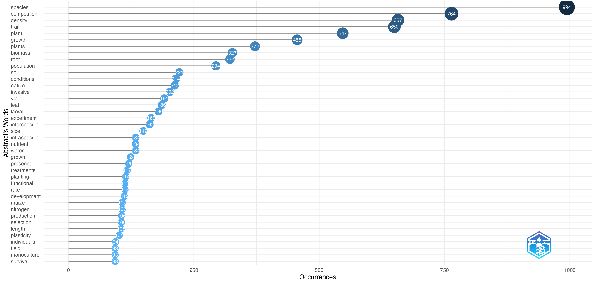
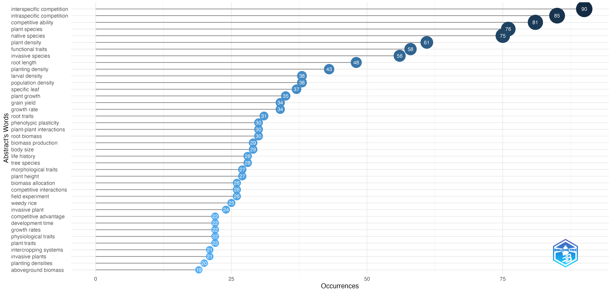
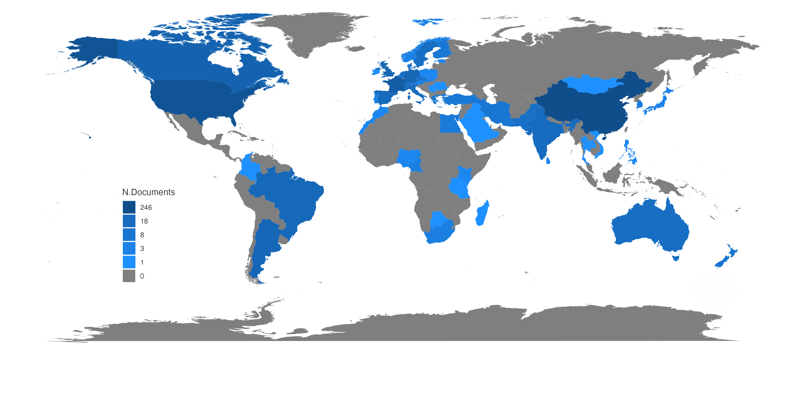
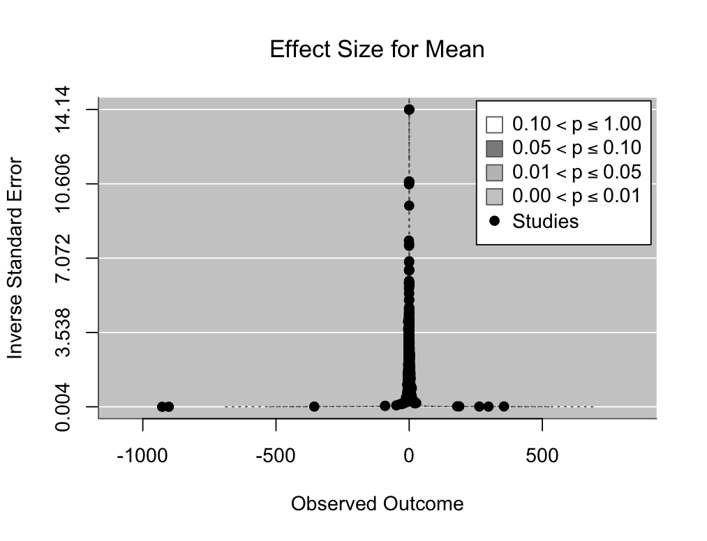
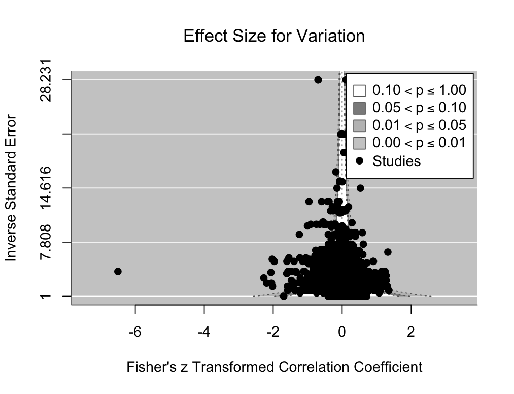

```{r setup, include=FALSE}
knitr::opts_chunk$set(echo = TRUE)
```

```{css, echo=FALSE}
.frame {
  background-color: orange;
  border: 3px solid black;
  font-weight: bold;
}
```

# 1. PRISMA diagram of this study
```{r}
knitr::include_graphics(rep("PRISMA.jpg"))
```

# 2.Bibliometrics analysis
```{r, warning=FALSE, echo=FALSE}
# library(bibliometrix)
# biblioshiny()
```

```{markdown, class.source="frame"}
With "biblioshiny()", it will pop up a website. After getting all the qualified papers, I downloaded the .ciw files of the papers (please remember to compress all the .ciw files to a .zip format to upload). I made the Most Frequent Words plots (Fig. 1a and Fig. 1b) for deciding the potential modifiers.(Documents -> Most Frequent Words)

And then I made the Countries’ scientific production plot (Fig. 2a). (Authors -> Countries -> Countries’ scientific production)
```




# Information on Data Sources
```{r, warning=FALSE}
# Load required installation packages
library(meta)
library(metafor)
library(Matrix)
library(metadat)
library(ggplot2)
library(readxl)
library(openxlsx)
library(dplyr)
library(multcomp)
library(tidyr)

# Dataset
data <- data.frame(
  Category = c(
    "Experimental", "Observational",
    "Directly from Articles or Tables", "PlotDigitizer Online App", "Raw Data in Papers"
  ),
  Type = c(
    "Research Approach", "Research Approach",
    "Data Sourcing Method", "Data Sourcing Method", "Data Sourcing Method"
  ),
  Articles = c(333, 13, 78, 229, 39),  # Corresponding # of Articles (N)
  Observations = c(3700, 79, 717, 1896, 1166)  # Corresponding # of Observations (K)
)

# Set category order
data$Category <- factor(data$Category, levels = c(
  "Experimental", "Observational",
  "Directly from Articles or Tables", "PlotDigitizer Online App", "Raw Data in Papers"
))

# Figure 2b: Bar chart for the number of articles
p1 <- ggplot(data, aes(x = Category, y = Articles, fill = Type)) +
  geom_bar(stat = "identity", position = "dodge") + 
  scale_fill_manual(values = c("gray", "skyblue")) +
  scale_y_continuous(limits = c(0, 360)) + 
  labs(
    x = "Category",
    y = "Number of Articles"
  ) +
  theme(
    axis.text.x = element_text(angle = 45, hjust = 1, size = 10), # Adjust x-axis text size
    axis.text.y = element_text(size = 10), # Adjust y-axis text size
    panel.background = element_rect(color = "gray", fill = "white", size = 0.6),        
    plot.background = element_blank(),         
    panel.grid.major = element_blank(),        
    panel.grid.minor = element_blank(),
    legend.background = element_blank(),
    legend.key = element_blank(),
    legend.title = element_blank(),
    panel.border = element_rect(color = "gray", fill = NA, size = 1) # Add border
  )

# Figure 2c: Bar chart for the number of observations
p2 <- ggplot(data, aes(x = Category, y = Observations, fill = Type)) +
  geom_bar(stat = "identity", position = "dodge") + 
  scale_fill_manual(values = c("gray", "skyblue")) +
  scale_y_continuous(limits = c(0, 4000)) + 
  labs(
    x = "Category",
    y = "Number of Observations"
  ) +
  theme(
    axis.text.x = element_text(angle = 45, hjust = 1, size = 10), # Adjust x-axis text size
    axis.text.y = element_text(size = 10), # Adjust y-axis text size
    panel.background = element_rect(color = "gray", fill = "white", size = 0.6),        
    plot.background = element_blank(),         
    panel.grid.major = element_blank(),        
    panel.grid.minor = element_blank(),
    legend.background = element_blank(),
    legend.key = element_blank(),
    legend.title = element_blank(),
    panel.border = element_rect(color = "gray", fill = NA, size = 1) # Add border
  )

# Display the two charts
print(p1)
print(p2)
```

# 3. Multivariate meta-analysis
```{r, warning=FALSE}
# Read data
data = read_excel(path = "Table S1 - Data File.xlsx", sheet = "Without microbes")

# Convert Treatment column to numeric
data$Treatment = as.numeric(data$Treatment)

# Insert the response coefficient and id column
id = 1:length(data$Treatment)
data = data.frame(id, data)
```

## 3.1 Overall effect
### 3.1.1 Overall effect for trait mean
```{r, warning=FALSE}
ddd.new <- escalc(measure = "ROM", m2i = Control, m1i = Treatment, sd1i = Treatment_SD, sd2i = Control_SD, n1i = Treatment_N, n2i = Control_N, data = data) # refer to Nakagawa et al. (2015)
```

### 3.1.2 Overall effect for trait variation
```{r, warning=FALSE}
cl = lm(data$Control ~ data$Control_SD)
summary(cl)

tl = lm(data$Treatment ~ data$Treatment_SD)
summary(tl) # There is correlation, using lnCVR is that it can reduce the influence of mean on variance when there is a strong correlation between trait mean and variance

rd <- escalc(measure = "CVR", m2i = Control, m1i = Treatment, sd1i = Treatment_SD + 0.01, sd2i = Control_SD + 0.01, n1i = Treatment_N, n2i = Control_N, data = data) # + 0.01 to avoid NAs
```

## 3.2 Invasion
### 3.2.1 Invasion trait mean
```{r, warning=FALSE}
rmod.mix0 <- rma.mv(yi ~ 1, V = vi, random = list(~1 |Study/id, ~1 |Pub_Year, ~1 |Ecosystem, ~1 |Study_Test_Type), method = "ML", data = ddd.new)
rmod.mix0

rmod.mix <- rma.mv(yi ~ factor(Native_Nonnative) - 1, vi, random = list(~1 |Study/id, ~1 |Pub_Year, ~1 |Ecosystem, ~1 |Study_Test_Type), method = "ML", data = ddd.new)
rmod.mix

summary(glht(rmod.mix, linfct=cbind(contrMat(c("factor(Native_Nonnative)1"=1,"factor(Native_Nonnative)2"=1,"factor(Native_Nonnative)3"=1, "factor(Native_Nonnative)4"=1 ), type="Tukey"))), test=adjusted("none")) # To compare the differences in effect sizes between different conditions
```

### 3.2.2 Invasion trait variation
```{r, warning=FALSE}
rmod.mix0.v <- rma.mv(yi ~ 1, V = vi, random = list(~1 |Study/id, ~1 |Pub_Year, ~1 |Ecosystem, ~1 |Study_Test_Type), method = "ML", data = rd)
rmod.mix0.v

rmod.mix.v <- rma.mv(yi ~ factor(Native_Nonnative) - 1, vi, random = list(~1 |Study/id, ~1 |Pub_Year, ~1 |Ecosystem, ~1 |Study_Test_Type), method = "ML", data = rd)
rmod.mix.v

summary(glht(rmod.mix.v, linfct=cbind(contrMat(c("factor(Native_Nonnative)1"=1,"factor(Native_Nonnative)2"=1,"factor(Native_Nonnative)3"=1, "factor(Native_Nonnative)4"=1 ), type="Tukey"))), test=adjusted("none")) # To compare the differences in effect sizes between different conditions
```

## 3.3 Test for modifiers
### 3.3.1 Organisms trait
#### 3.3.1.1 Organisms trait mean
```{r, warning=FALSE}
# Overall
rmod.mix.org <- rma.mv(yi ~ factor(Organism) - 1, vi, random = list(~1 |Study/id, ~1 |Pub_Year, ~1 |Ecosystem, ~1 |Study_Test_Type), method = "ML", data = ddd.new)
rmod.mix.org

# Interaction
rmod.mix.o <- rma.mv(yi ~ 0 + paste(factor(Native_Nonnative), factor(Organism)), vi, random = list(~1 |Study/id, ~1 |Pub_Year, ~1 |Ecosystem, ~1 |Study_Test_Type), method = "ML", data = ddd.new)
rmod.mix.o

# Post-hoc test
glht_test <- glht(rmod.mix.o, linfct = contrMat(coef(rmod.mix.o), type = "Tukey"))
summary(glht_test, test = adjusted("none"))
```

#### 3.3.1.2 Organisms trait variation
```{r, warning=FALSE}
# Overall
rmod.mix.org.v <- rma.mv(yi ~ factor(Organism) - 1, vi, random = list(~1 |Study/id, ~1 |Pub_Year, ~1 |Ecosystem, ~1 |Study_Test_Type), method = "ML", data = rd)
rmod.mix.org.v

# Interaction
rmod.mix.o.v <- rma.mv(yi ~ 0 + paste(factor(Native_Nonnative), factor(Organism)), vi, random = list(~1 |Study/id, ~1 |Pub_Year, ~1 |Ecosystem, ~1 |Study_Test_Type), method = "ML", data = rd)
rmod.mix.o.v

# Post-hoc test
glht_test <- glht(rmod.mix.o.v, linfct = contrMat(coef(rmod.mix.o.v), type = "Tukey"))
summary(glht_test, test = adjusted("none"))
```

### 3.3.2 Trait type
#### 3.3.2.1 Trait type mean
```{r, warning=FALSE}
# Overall
rmod.mix.tr <- rma.mv(yi ~ factor(Trait_type) - 1, vi, random = list(~1 |Study/id, ~1 |Pub_Year, ~1 |Ecosystem, ~1 |Study_Test_Type), method = "ML", data = ddd.new)
rmod.mix.tr

# Interaction
rmod.mix.t <- rma.mv(yi ~ 0 + paste(factor(Native_Nonnative), factor(Trait_type)), vi, random = list(~1 |Study/id, ~1 |Pub_Year, ~1 |Ecosystem, ~1 |Study_Test_Type), method = "ML", data = ddd.new)
rmod.mix.t

# Post-hoc test
glht_test <- glht(rmod.mix.t, linfct = contrMat(coef(rmod.mix.t), type = "Tukey"))
summary(glht_test, test = adjusted("none"))
```

#### 3.3.2.2 Trait type variation
```{r, warning=FALSE}
# Overall
rmod.mix.tr.v <- rma.mv(yi ~ factor(Trait_type) - 1, vi, random = list(~1 |Study/id, ~1 |Pub_Year, ~1 |Ecosystem, ~1 |Study_Test_Type), method = "ML", data = rd)
rmod.mix.tr.v

# Interaction
rmod.mix.t.v <- rma.mv(yi ~ 0 + paste(factor(Native_Nonnative), factor(Trait_type)), vi, random = list(~1 |Study/id, ~1 |Pub_Year, ~1 |Ecosystem, ~1 |Study_Test_Type), method = "ML", data = rd)
rmod.mix.t.v

# Post-hoc test
glht_test <- glht(rmod.mix.t.v, linfct = contrMat(coef(rmod.mix.t.v), type = "Tukey"))
summary(glht_test, test = adjusted("none"))
```

### 3.3.3 Competition type
#### 3.3.3.1 Competition type trait mean
```{r, warning=FALSE}
# Overall
rmod.mix.comp <- rma.mv(yi ~ factor(Competitor_Type) - 1, vi, random = list(~1 |Study/id, ~1 |Pub_Year, ~1 |Ecosystem, ~1 |Study_Test_Type), method = "ML", data = ddd.new)
rmod.mix.comp

# Interaction
rmod.mix.c <- rma.mv(yi ~ 0 + paste(factor(Native_Nonnative), factor(Competitor_Type)), vi, random = list(~1 |Study/id, ~1 |Pub_Year, ~1 |Ecosystem, ~1 |Study_Test_Type), method = "ML", data = ddd.new)
rmod.mix.c

# Post-hoc test
glht_test <- glht(rmod.mix.c, linfct = contrMat(coef(rmod.mix.c), type = "Tukey"))
summary(glht_test, test = adjusted("none"))
```

#### 3.3.3.2 Competition type trait variation
```{r, warning=FALSE}
# Overall
rmod.mix.comp.v <- rma.mv(yi ~ factor(Competitor_Type) - 1, vi, random = list(~1 |Study/id, ~1 |Pub_Year, ~1 |Ecosystem, ~1 |Study_Test_Type), method = "ML", data = rd)
rmod.mix.comp.v

# Interaction
rmod.mix.c.v <- rma.mv(yi ~ 0 + paste(factor(Native_Nonnative), factor(Competitor_Type)), vi, random = list(~1 |Study/id, ~1 |Pub_Year, ~1 |Ecosystem, ~1 |Study_Test_Type), method = "ML", data = rd)
rmod.mix.c.v

# Post-hoc test
glht_test <- glht(rmod.mix.c.v, linfct = contrMat(coef(rmod.mix.c.v), type = "Tukey"))
summary(glht_test, test = adjusted("none"))
```

# 4. Graph
## 4.1 Main figures
```{r, warning=FALSE}
# Overall mean
d = read.xlsx("Mean for graphs_0725.xlsx", sheet = "Overall")
txt <- d[,c(1)]
hr <- d[,c(2:9)] 

study_names <- txt
effect_estimates <- hr$mean
ci_lower <- hr$lower
ci_upper <- hr$upper
Category <- d$X9
data <- data.frame(study = study_names, effect = effect_estimates, ci_lower = ci_lower, ci_upper = ci_upper, Category = Category)
data$study <- factor(data$study, levels = c("Nonnative on nonnative (K = 158)",
                                            "Native on nonnative (K = 328)",
                                            "Nonnative on native (K = 388)",
                                            "Native on native (K = 2995)",
                                            "Overall effect (K = 3779)"))
data$Category <- factor(data$Category,
                        levels = c("Overall",
                                   "Native on native",
                                   "Nonnative on native",
                                   "Native on nonnative",
                                   "Nonnative on nonnative"))

# Convert y variables to ordered factors
data <- data[1:5,]

# Create forest plots using the preferred style
p <- ggplot(data, aes(y = study, x = effect, color = Category))
p <- p + geom_pointrange(aes(xmin = ci_lower, xmax = ci_upper), position = position_dodge(0.5), size = 0.5)
p <- p + geom_point(size = 4)
p <- p +
  theme( 
  panel.background = element_rect(color = "gray", fill = "white", size = 0.6),        
  plot.background = element_blank(),         
  panel.grid.major = element_blank(),        
  panel.grid.minor = element_blank(),
  plot.title = element_text(hjust = 0.5, size = rel(0.8), vjust = 0), legend.position = "none")
p <- p + labs(x = "Effect Size (lnRR)", y = "")  # Adding axis labels
p <- p + geom_vline(xintercept = 0, color = "darkgray", linetype = "dashed", size = 0.6)
p <- p + scale_color_manual(values = c("black", "#6A9FB5", "#A3BFD9", "brown", "antiquewhite3"))
p <- p + scale_x_continuous(limits = c(-0.4, 0.1))

# Print the plot
print(p)

# Overall variation
d = read.xlsx("Variation for graphs_0725.xlsx", sheet = "Overall")
txt <- d[,c(1)]
hr <- d[,c(2:9)] 

study_names <- txt
effect_estimates <- hr$mean
ci_lower <- hr$lower
ci_upper <- hr$upper
Category <- d$X9
data <- data.frame(study = study_names, effect = effect_estimates, ci_lower = ci_lower, ci_upper = ci_upper, Category = Category) 
data$study <- factor(data$study, levels = c("Nonnative on nonnative (K = 158)",
                                            "Native on nonnative (K = 328)",
                                            "Nonnative on native (K = 388)",
                                            "Native on native (K = 2995)",
                                            "Overall effect (K = 3779)"))
data$Category <- factor(data$Category,
                        levels = c("Overall",
                                   "Native on native",
                                   "Nonnative on native",
                                   "Native on nonnative",
                                   "Nonnative on nonnative"))

# Convert y variables to ordered factors
data <- data[1:5,]

# Create forest plots using the preferred style
p <- ggplot(data, aes(y = study, x = effect, color = Category))
p <- p + geom_point(size = 4)
p <- p + geom_pointrange(aes(xmin = ci_lower, xmax = ci_upper), position = position_dodge(0.5), size = 0.5)
p <- p +
  theme( 
  panel.background = element_rect(color = "gray", fill = "white", size = 0.6),        
  plot.background = element_blank(),         
  panel.grid.major = element_blank(),        
  panel.grid.minor = element_blank(),
  plot.title = element_text(hjust = 0.5, size = rel(0.8), vjust = 0),
  legend.position = "none"
)
p <- p + labs(x = "Effect Size (lnCVR)", y = "")  # Adding axis labels
p <- p + geom_vline(xintercept = 0, color = "darkgray", linetype = "dashed", size = 0.6)
p <- p + scale_color_manual(values = c("black", "#6A9FB5", "#A3BFD9", "brown", "antiquewhite3"))
p <- p + scale_x_continuous(limits = c(-0.1, 0.4))

# Print the plot
print(p)

# Organism types mean
d <- read.xlsx("Mean for graphs_0725.xlsx", sheet = "Organisms")
txt <- d[1:11, 1]
hr <- d[1:11, 2:9]

study_names <- txt
effect_estimates <- hr$mean
ci_lower <- hr$lower
ci_upper <- hr$upper
Category <- d$X9[1:11]

# Create the data frame
data <- data.frame(study = study_names, effect = effect_estimates, ci_lower = ci_lower, ci_upper = ci_upper,
                   Category = Category)
data$Category <- factor(data$Category,
                        levels = c("Overall",
                                   "Native on native",
                                   "Nonnative on native",
                                   "Native on nonnative",
                                   "Nonnative on nonnative"))

# Adjusting factor levels with spacing
data$study <- factor(data$study, levels = c(
"Nonnative on nonnative (K = 12)",
"Native on nonnative (K = 13)",
"Nonnative on native (K = 25)",
"Native on native (K = 468)",
"Overall effect (K = 518)",
" ",
"Nonnative on nonnative (K = 146)",
"Native on nonnative (K = 315)",
"Nonnative on native (K = 363)",
"Native on native (K = 2437)",
"Overall effect (K = 3261)"))

# Plot
ggplot(data, aes(y = study, x = effect, xmin = ci_lower, xmax = ci_upper, color = Category)) +
  geom_errorbar(aes(xmin = ci_lower, xmax = ci_upper), width = 0) +
  geom_point(size = 4)+
  scale_y_discrete(breaks = levels(data$study), labels = levels(data$study), limits = levels(data$study))+
  scale_x_continuous(limits = c(-0.75, 0.35)) +
  geom_vline(xintercept = 0, linetype = "dashed", color = "darkgray") +
  theme( 
  panel.background = element_rect(color = "gray", fill = "white", size = 0.6),        
  plot.background = element_blank(),         
  panel.grid.major = element_blank(),        
  panel.grid.minor = element_blank(),        
  plot.title = element_text(hjust = 0.5, size = rel(0.8), vjust = 0),
  legend.position = "none") +
  labs(y = " ", x = "Effect Size (lnRR)") +
  theme(axis.text.y = element_text(angle = 0, hjust = 1)) + 
  scale_color_manual(values = c("black", "#6A9FB5", "#A3BFD9", "brown", "antiquewhite3", "black", "#6A9FB5", "#A3BFD9", "brown", "antiquewhite3", "black", "#6A9FB5", "#A3BFD9", "brown", "antiquewhite3"))

# Organism types variation
d <- read.xlsx("Variation for graphs_0725.xlsx", sheet = "Organisms")
txt <- d[1:11, 1]
hr <- d[1:11, 2:9]

study_names <- txt
effect_estimates <- hr$mean
ci_lower <- hr$lower
ci_upper <- hr$upper
Category <- d$X9

# Create the data frame
data <- data.frame(study = study_names, effect = effect_estimates, ci_lower = ci_lower, ci_upper = ci_upper,
                   Category = Category)
data$Category <- factor(data$Category,
                        levels = c("Overall",
                                   "Native on native",
                                   "Nonnative on native",
                                   "Native on nonnative",
                                   "Nonnative on nonnative"))

# Adjusting factor levels with spacing
data$study <- factor(data$study, levels = c(
"Nonnative on nonnative (K = 12)",
"Native on nonnative (K = 13)",
"Nonnative on native (K = 25)",
"Native on native (K = 468)",
"Overall effect (K = 518)",
" ",
"Nonnative on nonnative (K = 146)",
"Native on nonnative (K = 315)",
"Nonnative on native (K = 363)",
"Native on native (K = 2437)",
"Overall effect (K = 3261)"))

# Plot
ggplot(data, aes(y = study, x = effect, xmin = ci_lower, xmax = ci_upper, color = Category)) +
  geom_errorbar(aes(xmin = ci_lower, xmax = ci_upper), width = 0) +
  geom_point(size = 4) +
  scale_y_discrete(breaks = levels(data$study), labels = levels(data$study), limits = levels(data$study)) +
  scale_x_continuous(limits = c(-0.6, 2.4)) +
  geom_vline(xintercept = 0, linetype = "dashed", color = "darkgray") +
  theme( 
  panel.background = element_rect(color = "gray", fill = "white", size = 0.6),        
  plot.background = element_blank(),         
  panel.grid.major = element_blank(),        
  panel.grid.minor = element_blank(),        
  plot.title = element_text(hjust = 0.5, size = rel(0.8), vjust = 0),
  legend.position = "none") +
  labs(y = " ", x = "Effect Size (lnCVR)") +
  theme(axis.text.y = element_text(angle = 0, hjust = 1)) + 
  scale_color_manual(values = c("black", "#6A9FB5", "#A3BFD9", "brown", "antiquewhite3", "black", "#6A9FB5", "#A3BFD9", "brown", "antiquewhite3", "black", "#6A9FB5", "#A3BFD9", "brown", "antiquewhite3"))

# Trait types mean
d <- read.xlsx("Mean for graphs_0725.xlsx", sheet = "Trait types")
txt <- d[1:16, 1]
hr <- d[1:16, 2:9]

study_names <- txt
effect_estimates <- hr$mean
ci_lower <- hr$lower
ci_upper <- hr$upper
Category <- d$X9

# Create the data frame
data <- data.frame(study = study_names, effect = effect_estimates, ci_lower = ci_lower, ci_upper = ci_upper,
                   Category = Category)
data$Category <- factor(data$Category,
                        levels = c("Overall",
                                   "Native on native",
                                   "Nonnative on native",
                                   "Native on nonnative",
                                   "Nonnative on nonnative"))

# Adjusting factor levels with spacing
data$study <- factor(data$study, levels = c(
"Native on nonnative (K = 58)",
"Nonnative on native (K = 51)",
"Native on native (K = 547)",
"Overall effect (K = 659)",
"  ",
"Nonnative on nonnative (K = 27)",
"Native on nonnative (K = 34)",
"Nonnative on native (K = 54)",
"Native on native (K = 495)",
"Overall effect (K = 610)",
" ",
"Nonnative on nonnative (K = 128)",
"Native on nonnative (K = 236)",
"Nonnative on native (K = 283)",
"Native on native (K = 1863)",
"Overall effect (K = 2510)"))

# Plot
ggplot(data, aes(y = study, x = effect, xmin = ci_lower, xmax = ci_upper, color = Category)) +
  geom_errorbar(aes(xmin = ci_lower, xmax = ci_upper), width = 0) +
  geom_point(size = 4) +
  scale_y_discrete(breaks = levels(data$study), labels = levels(data$study), limits = levels(data$study)) +
  scale_x_continuous(limits = c(-0.78, 0.34)) + 
  geom_vline(xintercept = 0, linetype = "dashed", color = "darkgray") +
  theme( 
  panel.background = element_rect(color = "gray", fill = "white", size = 0.6),        
  plot.background = element_blank(),         
  panel.grid.major = element_blank(),        
  panel.grid.minor = element_blank(),        
  plot.title = element_text(hjust = 0.5, size = rel(0.8), vjust = 0),
  legend.position = "none") +
  labs(y = " ", x = "Effect Size (lnRR)") +
  theme(axis.text.y = element_text(angle = 0, hjust = 1)) + 
  scale_color_manual(values = c("black", "#6A9FB5", "#A3BFD9", "brown", "antiquewhite3", "black", "#6A9FB5", "brown", "antiquewhite3", "black", "#6A9FB5", "#A3BFD9", "brown", "antiquewhite3"))

# Trait types variation
d <- read.xlsx("Variation for graphs_0725.xlsx", sheet = "Trait types")
txt <- d[1:16, 1]
hr <- d[1:16, 2:9]

study_names <- txt
effect_estimates <- hr$mean
ci_lower <- hr$lower
ci_upper <- hr$upper
Category <- d$X9

# Create the data frame
data <- data.frame(study = study_names, effect = effect_estimates, ci_lower = ci_lower, ci_upper = ci_upper,
                   Category = Category)
data$Category <- factor(data$Category,
                        levels = c("Overall",
                                   "Native on native",
                                   "Nonnative on native",
                                   "Native on nonnative",
                                   "Nonnative on nonnative"))

# Adjusting factor levels with spacing
data$study <- factor(data$study, levels = c(
"Native on nonnative (K = 58)",
"Nonnative on native (K = 51)",
"Native on native (K = 547)",
"Overall effect (K = 659)",
"  ",
"Nonnative on nonnative (K = 27)",
"Native on nonnative (K = 34)",
"Nonnative on native (K = 54)",
"Native on native (K = 495)",
"Overall effect (K = 610)",
" ",
"Nonnative on nonnative (K = 128)",
"Native on nonnative (K = 236)",
"Nonnative on native (K = 283)",
"Native on native (K = 1863)",
"Overall effect (K = 2510)"))

# Plot
ggplot(data, aes(y = study, x = effect, xmin = ci_lower, xmax = ci_upper, color = Category)) +
  geom_errorbar(aes(xmin = ci_lower, xmax = ci_upper), width = 0) +
  geom_point(size = 4) +
  scale_y_discrete(breaks = levels(data$study), labels = levels(data$study), limits = levels(data$study)) +
  scale_x_continuous(limits = c(-0.5, 1.2)) + 
  geom_vline(xintercept = 0, linetype = "dashed", color = "darkgray") +
  theme( 
  panel.background = element_rect(color = "gray", fill = "white", size = 0.6),        
  plot.background = element_blank(),         
  panel.grid.major = element_blank(),        
  panel.grid.minor = element_blank(),
  plot.title = element_text(hjust = 0.5, size = rel(0.8), vjust = 0),
  legend.position = "none") +
  labs(y = " ", x = "Effect Size (lnCVR)") +
  theme(axis.text.y = element_text(angle = 0, hjust = 1)) + 
  scale_color_manual(values = c("black", "#6A9FB5", "#A3BFD9", "brown", "antiquewhite3", "black", "#6A9FB5", "brown", "antiquewhite3", "black", "#6A9FB5", "#A3BFD9", "brown", "antiquewhite3"))

# Competition types mean
d <- read.xlsx("Mean for graphs_0725.xlsx", sheet = "Competition types")
txt <- d[1:9, 1]
hr <- d[1:9, 2:9]

study_names <- txt
effect_estimates <- hr$mean
ci_lower <- hr$lower
ci_upper <- hr$upper
Category <- d$X9

# Create the data frame
data <- data.frame(study = study_names, effect = effect_estimates, ci_lower = ci_lower, ci_upper = ci_upper,
                   Category = Category)
data$Category <- factor(data$Category,
                        levels = c("Overall",
                                   "Native on native",
                                   "Nonnative on native",
                                   "Native on nonnative",
                                   "Nonnative on nonnative"))

# Adjusting factor levels with spacing
data$study <- factor(data$study, levels = c(
"Nonnative on nonnative (K = 55)",
"Native on nonnative (K = 328)",
"Nonnative on native (K = 388)",
"Native on native (K = 1867)",
"Overall effect (K = 2638)",
" ",
"Nonnative on nonnative (K = 103)",
"Native on native (K = 1038)",
"Overall effect (K = 1141)"))

# Plot
ggplot(data, aes(y = study, x = effect, xmin = ci_lower, xmax = ci_upper, color = Category)) +
  geom_errorbar(aes(xmin = ci_lower, xmax = ci_upper), width = 0) +
  geom_point(size = 4) +
  scale_y_discrete(breaks = levels(data$study), labels = levels(data$study), limits = levels(data$study)) +
  scale_x_continuous(limits = c(-0.5, 0.49)) +
  geom_vline(xintercept = 0, linetype = "dashed", color = "darkgray") +
  theme( 
  panel.background = element_rect(color = "gray", fill = "white", size = 0.6),        
  plot.background = element_blank(),         
  panel.grid.major = element_blank(),        
  panel.grid.minor = element_blank(),
  plot.title = element_text(hjust = 0.5, size = rel(0.8), vjust = 0),
  legend.position = "none") +
  labs(y = " ", x = "Effect Size (lnRR)") +
  theme(axis.text.y = element_text(angle = 0, hjust = 1)) + 
  scale_color_manual(values = c("black", "#6A9FB5", "#A3BFD9", "brown", "antiquewhite3", "black", "#6A9FB5", "#A3BFD9", "brown", "antiquewhite3", "black", "#6A9FB5", "#A3BFD9", "brown", "antiquewhite3"))

# Competition types variation
d <- read.xlsx("Variation for graphs_0725.xlsx", sheet = "Competition types")
txt <- d[1:9, 1]
hr <- d[1:9, 2:9]

study_names <- txt
effect_estimates <- hr$mean
ci_lower <- hr$lower
ci_upper <- hr$upper
Category <- d$X9

# Create the data frame
data <- data.frame(study = study_names, effect = effect_estimates, ci_lower = ci_lower, ci_upper = ci_upper,
                   Category = Category)
data$Category <- factor(data$Category,
                        levels = c("Overall",
                                   "Native on native",
                                   "Nonnative on native",
                                   "Native on nonnative",
                                   "Nonnative on nonnative"))

# Adjusting factor levels with spacing
data$study <- factor(data$study, levels = c(
"Nonnative on nonnative (K = 55)",
"Native on nonnative (K = 328)",
"Nonnative on native (K = 388)",
"Native on native (K = 1867)",
"Overall effect (K = 2638)",
" ",
"Nonnative on nonnative (K = 103)",
"Native on native (K = 1038)",
"Overall effect (K = 1141)"))

# Plot
ggplot(data, aes(y = study, x = effect, xmin = ci_lower, xmax = ci_upper, color = Category)) +
  geom_errorbar(aes(xmin = ci_lower, xmax = ci_upper), width = 0) +
  geom_point(size = 4) +
  scale_y_discrete(breaks = levels(data$study), labels = levels(data$study), limits = levels(data$study)) +
  scale_x_continuous(limits = c(-0.1, 0.55)) +
  geom_vline(xintercept = 0, linetype = "dashed", color = "darkgray") +
  theme( 
  panel.background = element_rect(color = "gray", fill = "white", size = 0.6),        
  plot.background = element_blank(),         
  panel.grid.major = element_blank(),        
  panel.grid.minor = element_blank(),
  plot.title = element_text(hjust = 0.5, size = rel(0.8), vjust = 0),
  legend.position = "none") +
  labs(y = " ", x = "Effect Size (lnCVR)") +
  theme(axis.text.y = element_text(angle = 0, hjust = 1)) + 
  scale_color_manual(values = c("black", "#6A9FB5", "#A3BFD9", "brown", "antiquewhite3", "black", "#6A9FB5", "#A3BFD9", "brown", "antiquewhite3", "black", "#6A9FB5", "#A3BFD9", "brown", "antiquewhite3"))
```

## 4.2 Figures with data distributions
```{r, warning=FALSE}
# Overall mean
d = read.xlsx("Mean for graphs_0725.xlsx", sheet = "Overall")
txt <- d[,c(1)]
hr <- d[,c(2:9)] 

study_names <- txt
effect_estimates <- hr$mean
ci_lower <- hr$lower
ci_upper <- hr$upper
Category <- d$X9
data <- data.frame(study = study_names, effect = effect_estimates, ci_lower = ci_lower, ci_upper = ci_upper, Category = Category)
data$study <- factor(data$study, levels = c("Nonnative on nonnative (K = 158)",
                                            "Native on nonnative (K = 328)",
                                            "Nonnative on native (K = 388)",
                                            "Native on native (K = 2995)",
                                            "Overall effect (K = 3779)"))
data$Category <- factor(data$Category,
                        levels = c("Overall",
                                   "Native on native",
                                   "Nonnative on native",
                                   "Native on nonnative",
                                   "Nonnative on nonnative"))

# Convert y variables to ordered factors
data <- data[1:5,]

# Ensure Native_Nonnative is a character variable
ddd.new$Native_Nonnative <- as.character(ddd.new$Native_Nonnative)
NN_d = ddd.new[ddd.new$Native_Nonnative[] == "1",]
IN_d = ddd.new[ddd.new$Native_Nonnative[] == "2",]
II_d = ddd.new[ddd.new$Native_Nonnative[] == "3",]
NI_d = ddd.new[ddd.new$Native_Nonnative[] == "4",]

ddd.new$Native_Nonnative[ddd.new$Native_Nonnative == '1'] = 'Native on native (K = 2995)'
ddd.new$Native_Nonnative[ddd.new$Native_Nonnative == '2'] = 'Nonnative on native (K = 388)'
ddd.new$Native_Nonnative[ddd.new$Native_Nonnative == '3'] = 'Nonnative on nonnative (K = 158)'
ddd.new$Native_Nonnative[ddd.new$Native_Nonnative == '4'] = 'Native on nonnative (K = 328)'

# Create the Overall dataframe, aligning column names with ddd.new
ddd.new_overall <- data.frame(
  Native_Nonnative = "Overall effect (K = 3779)",  # Add Overall category
  yi = ddd.new$yi  # Include all yi data
)

# Add missing columns from ddd.new to ddd.new_overall
missing_cols <- setdiff(names(ddd.new), names(ddd.new_overall))  # Find columns missing in ddd.new_overall
for (col in missing_cols) {
  ddd.new_overall[[col]] <- NA  # Fill missing columns with NA
}

# Ensure ddd.new includes all columns in ddd.new_overall
extra_cols <- setdiff(names(ddd.new_overall), names(ddd.new))  # Find columns missing in ddd.new
for (col in extra_cols) {
  ddd.new[[col]] <- NA  # Fill missing columns with NA
}

# Combine datasets by rows
ddd.new_combined <- rbind(ddd.new, ddd.new_overall)

# Plot the ggplot visualization
p <- ggplot() +
      geom_jitter(data = ddd.new_combined, 
                  aes(y = Native_Nonnative, x = yi), 
                  alpha = 0.1, 
                  color = "lightgray",
                  width = 0.4, 
                  height = 0.1) +
      # Pointrange layer
      geom_pointrange(data = data, 
                      aes(y = study, x = effect, xmin = ci_lower, xmax = ci_upper, color = Category),
                      size = 0.5) +
      theme( 
  panel.background = element_rect(color = "gray", fill = "white", size = 0.6),        
  plot.background = element_blank(),         
  panel.grid.major = element_blank(),        
  panel.grid.minor = element_blank(),
  plot.title = element_text(hjust = 0.5, size = rel(0.8), vjust = 0),
  legend.position = "none") +
      labs(x = "Effect Size (lnRR)", y = "") +
      # Add reference line
      geom_vline(xintercept = 0, color = "darkgray", linetype = "dashed", size = 0.6) +
      # Customize colors
      scale_color_manual(values = c("black", "#6A9FB5", 
                                     "#A3BFD9", "brown", "antiquewhite3"))

# Print the plot
print(p)

# Overall variation
d = read.xlsx("Variation for graphs_0725.xlsx", sheet = "Overall")
txt <- d[,c(1)]
hr <- d[,c(2:9)] 

study_names <- txt
effect_estimates <- hr$mean
ci_lower <- hr$lower
ci_upper <- hr$upper
Category <- d$X9
data <- data.frame(study = study_names, effect = effect_estimates, ci_lower = ci_lower, ci_upper = ci_upper, Category = Category)
data$study <- factor(data$study, levels = c("Nonnative on nonnative (K = 158)",
                                            "Native on nonnative (K = 328)",
                                            "Nonnative on native (K = 388)",
                                            "Native on native (K = 2995)",
                                            "Overall effect (K = 3779)"))
data$Category <- factor(data$Category,
                        levels = c("Overall",
                                   "Native on native",
                                   "Nonnative on native",
                                   "Native on nonnative",
                                   "Nonnative on nonnative"))

# Convert y variables to ordered factors
data <- data[1:5,]

# Ensure Native_Nonnative is a character variable
NN_r = rd[rd$Native_Nonnative[] == "1",]
IN_r = rd[rd$Native_Nonnative[] == "2",]
II_r = rd[rd$Native_Nonnative[] == "3",]
NI_r = rd[rd$Native_Nonnative[] == "4",]

rd$Native_Nonnative[rd$Native_Nonnative == '1'] = 'Native on native (K = 2995)'
rd$Native_Nonnative[rd$Native_Nonnative == '2'] = 'Nonnative on native (K = 388)'
rd$Native_Nonnative[rd$Native_Nonnative == '3'] = 'Nonnative on nonnative (K = 158)'
rd$Native_Nonnative[rd$Native_Nonnative == '4'] = 'Native on nonnative (K = 328)'
rd$Native_Nonnative <- as.character(rd$Native_Nonnative)

# Create the Overall dataframe, ensuring column names match rd
rd_overall <- data.frame(
  Native_Nonnative = rep("Overall effect (K = 3779)", nrow(rd)),  # Add the Overall category
  yi = rd$yi  # Include all yi data
)

# Add missing columns from rd to rd_overall
missing_cols <- setdiff(names(rd), names(rd_overall))  # Find columns in rd that are missing in rd_overall
for (col in missing_cols) {
  rd_overall[[col]] <- NA  # Fill missing columns with NA
}

# Combine the two datasets by row
rd_combined <- rbind(rd, rd_overall)

# Create the ggplot visualization
p <- ggplot() +
      geom_jitter(data = rd_combined, 
                  aes(y = Native_Nonnative, x = yi), 
                  alpha = 0.1, 
                  color = "lightgray",
                  width = 0.4, 
                  height = 0.1) +
      # Pointrange layer
      geom_pointrange(data = data, 
                      aes(y = study, x = effect, xmin = ci_lower, xmax = ci_upper, color = Category),
                      size = 0.5) +
      theme(panel.background = element_rect(color = "gray", fill = "white", size = 0.6),        
            plot.background = element_blank(),         
            panel.grid.major = element_blank(),        
            panel.grid.minor = element_blank(),
            plot.title = element_text(hjust = 0.5, size = rel(0.8), vjust = 0),
            legend.position = "none") +
            labs(x = "Effect Size (lnCVR)", y = "")+
      # Add a reference line
      geom_vline(xintercept = 0, color = "darkgray", linetype = "dashed", size = 0.6) +
      # Customize colors
      scale_color_manual(values = c("black", "#6A9FB5", 
                                     "#A3BFD9", "brown", "antiquewhite3"))

# Print the plot
print(p)

# Organism types mean
d <- read.xlsx("Mean for graphs_0725.xlsx", sheet = "Organisms")
txt <- d[1:11, 1]
hr <- d[1:11, 2:9]

study_names <- txt
effect_estimates <- hr$mean
ci_lower <- hr$lower
ci_upper <- hr$upper
Category <- d[1:11,]$X9

# Create the data frame
data <- data.frame(study = study_names, effect = effect_estimates, ci_lower = ci_lower, ci_upper = ci_upper,
                   Category = Category)
data$Category <- factor(data$Category,
                        levels = c("Overall",
                                   "Native on native",
                                   "Nonnative on native",
                                   "Native on nonnative",
                                   "Nonnative on nonnative"))

# Adjusting factor levels with spacing
data$study <- factor(data$study, levels = c(
"Nonnative on nonnative (K = 12)",
"Native on nonnative (K = 13)",
"Nonnative on native (K = 25)",
"Native on native (K = 468)",
"Overall effect (K = 518)",
" ",
"Nonnative on nonnative (K = 146)",
"Native on nonnative (K = 315)",
"Nonnative on native (K = 363)",
"Native on native (K = 2437)",
"Overall effect (K = 3261)"))

# Plants
NN_d$Organism[NN_d$Organism == "1"] = "Native on native (K = 2437)"
II_d$Organism[II_d$Organism == "1"] = "Nonnative on nonnative (K = 146)"
NI_d$Organism[NI_d$Organism == "1"] = "Native on nonnative (K = 315)"
IN_d$Organism[IN_d$Organism == "1"] = "Nonnative on native (K = 363)"

# Animals
NN_d$Organism[NN_d$Organism == "2"] = "Native on native (K = 468)"
II_d$Organism[II_d$Organism == "2"] = "Nonnative on nonnative (K = 12)"
NI_d$Organism[NI_d$Organism == "2"] = "Native on nonnative (K = 13)"
IN_d$Organism[IN_d$Organism == "2"] = "Nonnative on native (K = 25)"

# Merge back into ddd.new
ddd.new <- rbind(NN_d, IN_d, II_d, NI_d)

# Filter matching conditions to create a new database
p_new_data <- ddd.new[ddd.new$Organism %in% c("1", "Native on native (K = 2437)", "Nonnative on nonnative (K = 146)", "Native on nonnative (K = 315)", "Nonnative on native (K = 363)"), ]
p_new_data$Organism <- "Overall effect (K = 3261)"
a_new_data <- ddd.new[ddd.new$Organism %in% c("2", "Native on native (K = 468)", "Nonnative on nonnative (K = 12)", "Native on nonnative (K = 13)", "Nonnative on native (K = 25)"), ]
a_new_data$Organism <- "Overall effect (K = 518)"

# Merge the new database and the old database
combined_data <- rbind(ddd.new, p_new_data, a_new_data)

# Plot the chart
ggplot() +
  # Jitter points for individual data points
  geom_jitter(
    data = combined_data,
    aes(y = Organism, x = yi),
    alpha = 0.1, 
    color = "lightgray", 
    width = 0.4, 
    height = 0.1
  ) +
  # Error bars and points from the main dataset
  geom_errorbar(
    data = data, 
    aes(y = study, x = effect, xmin = ci_lower, xmax = ci_upper, color = Category), 
    width = 0
  ) +
  geom_point(
    data = data, 
    aes(y = study, x = effect, color = Category), 
    size = 2
  ) +
  scale_y_discrete(
    breaks = levels(data$study), 
    labels = levels(data$study), 
    limits = levels(data$study)
  ) +
  geom_vline(xintercept = 0, linetype = "dashed", color = "darkgray") +
  theme( 
  panel.background = element_rect(color = "gray", fill = "white", size = 0.6),        
  plot.background = element_blank(),         
  panel.grid.major = element_blank(),        
  panel.grid.minor = element_blank(),
  plot.title = element_text(hjust = 0.5, size = rel(0.8), vjust = 0),
  legend.position = "none") +
  labs(y = " ", x = "Effect Size (lnRR)") +
  theme(axis.text.y = element_text(angle = 0, hjust = 1)) + 
  scale_color_manual(values = c(
    "black", "#6A9FB5", "#A3BFD9", 
    "brown", "antiquewhite3", "black", "#6A9FB5", 
    "brown", "antiquewhite3", "black", "#6A9FB5", 
    "#A3BFD9", "brown", "antiquewhite3"
  ))

# Organism types variation
d <- read.xlsx("Variation for graphs_0725.xlsx", sheet = "Organisms")
txt <- d[1:11, 1]
hr <- d[1:11, 2:9]

study_names <- txt
effect_estimates <- hr$mean
ci_lower <- hr$lower
ci_upper <- hr$upper
Category <- d[1:11,]$X9

# Create the data frame
data <- data.frame(study = study_names, effect = effect_estimates, ci_lower = ci_lower, ci_upper = ci_upper,
                   Category = Category)
data$Category <- factor(data$Category,
                        levels = c("Overall",
                                   "Native on native",
                                   "Nonnative on native",
                                   "Native on nonnative",
                                   "Nonnative on nonnative"))

# Adjusting factor levels with spacing
data$study <- factor(data$study, levels = c(
"Nonnative on nonnative (K = 12)",
"Native on nonnative (K = 13)",
"Nonnative on native (K = 25)",
"Native on native (K = 468)",
"Overall effect (K = 518)",
" ",
"Nonnative on nonnative (K = 146)",
"Native on nonnative (K = 315)",
"Nonnative on native (K = 363)",
"Native on native (K = 2437)",
"Overall effect (K = 3261)"))

# Plants
NN_r$Organism[NN_r$Organism == "1"] = "Native on native (K = 2437)"
II_r$Organism[II_r$Organism == "1"] = "Nonnative on nonnative (K = 146)"
NI_r$Organism[NI_r$Organism == "1"] = "Native on nonnative (K = 315)"
IN_r$Organism[IN_r$Organism == "1"] = "Nonnative on native (K = 363)"

# Animals
NN_r$Organism[NN_r$Organism == "2"] = "Native on native (K = 468)"
II_r$Organism[II_r$Organism == "2"] = "Nonnative on nonnative (K = 12)"
NI_r$Organism[NI_r$Organism == "2"] = "Native on nonnative (K = 13)"
IN_r$Organism[IN_r$Organism == "2"] = "Nonnative on native (K = 25)"

# Merge back into rd
rd <- rbind(NN_r, IN_r, II_r, NI_r)

# Filter matching conditions to create a new database
p_new_data <- rd[rd$Organism %in% c("1", "Native on native (K = 2437)", "Nonnative on nonnative (K = 146)", "Native on nonnative (K = 315)", "Nonnative on native (K = 363)"), ]
p_new_data$Organism <- "Overall effect (K = 3261)"
a_new_data <- rd[rd$Organism %in% c("2", "Native on native (K = 468)", "Nonnative on nonnative (K = 12)", "Native on nonnative (K = 13)", "Nonnative on native (K = 25)"), ]
a_new_data$Organism <- "Overall effect (K = 518)"

# Merge the new database and the old database
combined_data <- rbind(rd, p_new_data, a_new_data)

# Plot the chart
ggplot() +
  # Jitter points for individual data points
  geom_jitter(
    data = combined_data,
    aes(y = Organism, x = yi),
    alpha = 0.1, 
    color = "lightgray", 
    width = 0.4, 
    height = 0.1
  ) +
  # Error bars and points from the main dataset
  geom_errorbar(
    data = data, 
    aes(y = study, x = effect, xmin = ci_lower, xmax = ci_upper, color = Category), 
    width = 0
  ) +
  geom_point(
    data = data, 
    aes(y = study, x = effect, color = Category), 
    size = 2
  ) +
  scale_y_discrete(
    breaks = levels(data$study), 
    labels = levels(data$study), 
    limits = levels(data$study)
  ) +
  geom_vline(xintercept = 0, linetype = "dashed", color = "darkgray") +
  theme( 
  panel.background = element_rect(color = "gray", fill = "white", size = 0.6),        
  plot.background = element_blank(),         
  panel.grid.major = element_blank(),        
  panel.grid.minor = element_blank(),
  plot.title = element_text(hjust = 0.5, size = rel(0.8), vjust = 0),
  legend.position = "none") +
  labs(y = " ", x = "Effect Size (lnCVR)") +
  theme(axis.text.y = element_text(angle = 0, hjust = 1)) + 
  scale_color_manual(values = c(
    "black", "#6A9FB5", "#A3BFD9", 
    "brown", "antiquewhite3", "black", "#6A9FB5", 
    "brown", "antiquewhite3", "black", "#6A9FB5", 
    "#A3BFD9", "brown", "antiquewhite3"
  ))


# Trait types mean
d <- read.xlsx("Mean for graphs_0725.xlsx", sheet = "Trait types")
txt <- d[1:16, 1]
hr <- d[1:16, 2:9]

study_names <- txt
effect_estimates <- hr$mean
ci_lower <- hr$lower
ci_upper <- hr$upper
Category <- d$X9

# Create the data frame
data <- data.frame(study = study_names, effect = effect_estimates, ci_lower = ci_lower, ci_upper = ci_upper,
                   Category = Category)
data$Category <- factor(data$Category,
                        levels = c("Overall",
                                   "Native on native",
                                   "Nonnative on native",
                                   "Native on nonnative",
                                   "Nonnative on nonnative"))

# Adjusting factor levels with spacing
data$study <- factor(data$study, levels = c(
"Native on nonnative (K = 58)",
"Nonnative on native (K = 51)",
"Native on native (K = 547)",
"Overall effect (K = 659)",
"  ",
"Nonnative on nonnative (K = 27)",
"Native on nonnative (K = 34)",
"Nonnative on native (K = 54)",
"Native on native (K = 495)",
"Overall effect (K = 610)",
" ",
"Nonnative on nonnative (K = 128)",
"Native on nonnative (K = 236)",
"Nonnative on native (K = 283)",
"Native on native (K = 1863)",
"Overall effect (K = 2510)"))

# Morphological traits
NN_d$Trait_type[NN_d$Trait_type == "M"] = "Native on native (K = 1863)"
II_d$Trait_type[II_d$Trait_type == "M"] = "Nonnative on nonnative (K = 128)"
NI_d$Trait_type[NI_d$Trait_type == "M"] = "Native on nonnative (K = 236)"
IN_d$Trait_type[IN_d$Trait_type == "M"] = "Nonnative on native (K = 283)"

# Life history traits
NN_d$Trait_type[NN_d$Trait_type == "L"] = "Native on native (K = 495)"
II_d$Trait_type[II_d$Trait_type == "L"] = "Nonnative on nonnative (K = 27)"
NI_d$Trait_type[NI_d$Trait_type == "L"] = "Native on nonnative (K = 34)"
IN_d$Trait_type[IN_d$Trait_type == "L"] = "Nonnative on native (K = 54)"

# Chemical/Physiological traits
NN_d$Trait_type[NN_d$Trait_type == "C"] = "Native on native (K = 547)"
NI_d$Trait_type[NI_d$Trait_type == "C"] = "Native on nonnative (K = 58)"
IN_d$Trait_type[IN_d$Trait_type == "C"] = "Nonnative on native (K = 51)"

# Merge back into ddd.new
ddd.new <- rbind(NN_d, IN_d, II_d, NI_d)

# Filter matching conditions to create a new database
m_new_data <- ddd.new[ddd.new$Trait_type %in% c("M", "Native on native (K = 1863)", "Nonnative on nonnative (K = 128)", "Native on nonnative (K = 236)", "Nonnative on native (K = 283)"), ]
m_new_data$Trait_type <- "Overall effect (K = 2510)"
l_new_data <- ddd.new[ddd.new$Trait_type %in% c("L", "Native on native (K = 495)", "Nonnative on nonnative (K = 27)", "Native on nonnative (K = 34)", "Nonnative on native (K = 54)"), ]
l_new_data$Trait_type <- "Overall effect (K = 610)"
c_new_data <- ddd.new[ddd.new$Trait_type %in% c("C", "Native on native (K = 547)", "Native on nonnative (K = 58)", "Nonnative on native (K = 51)"), ]
c_new_data$Trait_type <- "Overall effect (K = 659)"

# Merge the new database and the old database
combined_data <- rbind(ddd.new, m_new_data, l_new_data, c_new_data)

# Plot the chart
ggplot() +
  # Jitter points for individual data points
  geom_jitter(
    data = combined_data,
    aes(y = Trait_type, x = yi),
    alpha = 0.1, 
    color = "lightgray", 
    width = 0.4, 
    height = 0.1
  ) +
  # Error bars and points from the main dataset
  geom_errorbar(
    data = data, 
    aes(y = study, x = effect, xmin = ci_lower, xmax = ci_upper, color = Category), 
    width = 0
  ) +
  geom_point(
    data = data, 
    aes(y = study, x = effect, color = Category), 
    size = 2
  ) +
  scale_y_discrete(
    breaks = levels(data$study), 
    labels = levels(data$study), 
    limits = levels(data$study)
  ) +
  geom_vline(xintercept = 0, linetype = "dashed", color = "darkgray") +
  theme( 
  panel.background = element_rect(color = "gray", fill = "white", size = 0.6),        
  plot.background = element_blank(),         
  panel.grid.major = element_blank(),        
  panel.grid.minor = element_blank(),
  plot.title = element_text(hjust = 0.5, size = rel(0.8), vjust = 0),
  legend.position = "none") +
  labs(y = " ", x = "Effect Size (lnRR)") +
  theme(axis.text.y = element_text(angle = 0, hjust = 1)) + 
  scale_color_manual(values = c(
    "black", "#6A9FB5", "#A3BFD9", 
    "brown", "antiquewhite3", "black", "#6A9FB5", 
    "brown", "antiquewhite3", "black", "#6A9FB5", 
    "#A3BFD9", "brown", "antiquewhite3"
  ))

# Trait types variation
d <- read.xlsx("Variation for graphs_0725.xlsx", sheet = "Trait types")
txt <- d[1:16, 1]
hr <- d[1:16, 2:9]

study_names <- txt
effect_estimates <- hr$mean
ci_lower <- hr$lower
ci_upper <- hr$upper
Category <- d$X9

# Create the data frame
data <- data.frame(study = study_names, effect = effect_estimates, ci_lower = ci_lower, ci_upper = ci_upper,
                   Category = Category)
data$Category <- factor(data$Category,
                        levels = c("Overall",
                                   "Native on native",
                                   "Nonnative on native",
                                   "Native on nonnative",
                                   "Nonnative on nonnative"))

# Adjusting factor levels with spacing
data$study <- factor(data$study, levels = c(
"Native on nonnative (K = 58)",
"Nonnative on native (K = 51)",
"Native on native (K = 547)",
"Overall effect (K = 659)",
"  ",
"Nonnative on nonnative (K = 27)",
"Native on nonnative (K = 34)",
"Nonnative on native (K = 54)",
"Native on native (K = 495)",
"Overall effect (K = 610)",
" ",
"Nonnative on nonnative (K = 128)",
"Native on nonnative (K = 236)",
"Nonnative on native (K = 283)",
"Native on native (K = 1863)",
"Overall effect (K = 2510)"))

# Morphological traits
NN_r$Trait_type[NN_r$Trait_type == "M"] = "Native on native (K = 1863)"
II_r$Trait_type[II_r$Trait_type == "M"] = "Nonnative on nonnative (K = 128)"
NI_r$Trait_type[NI_r$Trait_type == "M"] = "Native on nonnative (K = 236)"
IN_r$Trait_type[IN_r$Trait_type == "M"] = "Nonnative on native (K = 283)"

# Life history traits
NN_r$Trait_type[NN_r$Trait_type == "L"] = "Native on native (K = 495)"
II_r$Trait_type[II_r$Trait_type == "L"] = "Nonnative on nonnative (K = 27)"
NI_r$Trait_type[NI_r$Trait_type == "L"] = "Native on nonnative (K = 34)"
IN_r$Trait_type[IN_r$Trait_type == "L"] = "Nonnative on native (K = 54)"

# Chemical/Physiological traits
NN_r$Trait_type[NN_r$Trait_type == "C"] = "Native on native (K = 547)"
NI_r$Trait_type[NI_r$Trait_type == "C"] = "Native on nonnative (K = 58)"
IN_r$Trait_type[IN_r$Trait_type == "C"] = "Nonnative on native (K = 51)"

# Merge back into rd
rd <- rbind(NN_r, IN_r, II_r, NI_r)

# Filter matching conditions to create a new database
m_new_data <- rd[rd$Trait_type %in% c("M", "Native on native (K = 1863)", "Nonnative on nonnative (K = 128)", "Native on nonnative (K = 236)", "Nonnative on native (K = 283)"), ]
m_new_data$Trait_type <- "Overall effect (K = 2510)"
l_new_data <- rd[rd$Trait_type %in% c("L", "Native on native (K = 495)", "Nonnative on nonnative (K = 27)", "Native on nonnative (K = 34)", "Nonnative on native (K = 54)"), ]
l_new_data$Trait_type <- "Overall effect (K = 610)"
c_new_data <- rd[rd$Trait_type %in% c("C", "Native on native (K = 547)", "Native on nonnative (K = 58)", "Nonnative on native (K = 51)"), ]
c_new_data$Trait_type <- "Overall effect (K = 659)"

# Merge the new database and the old database
combined_data <- rbind(rd, m_new_data, l_new_data, c_new_data)

# Plot the chart
ggplot() +
  # Jitter points for individual data points
  geom_jitter(
    data = combined_data,
    aes(y = Trait_type, x = yi),
    alpha = 0.1, 
    color = "lightgray", 
    width = 0.4, 
    height = 0.1
  ) +
  # Error bars and points from the main dataset
  geom_errorbar(
    data = data, 
    aes(y = study, x = effect, xmin = ci_lower, xmax = ci_upper, color = Category), 
    width = 0
  ) +
  geom_point(
    data = data, 
    aes(y = study, x = effect, color = Category), 
    size = 2
  ) +
  scale_y_discrete(
    breaks = levels(data$study), 
    labels = levels(data$study), 
    limits = levels(data$study)
  ) +
  geom_vline(xintercept = 0, linetype = "dashed", color = "darkgray") +
  theme( 
  panel.background = element_rect(color = "gray", fill = "white", size = 0.6),        
  plot.background = element_blank(),         
  panel.grid.major = element_blank(),        
  panel.grid.minor = element_blank(),
  plot.title = element_text(hjust = 0.5, size = rel(0.8), vjust = 0),
  legend.position = "none") +
  labs(y = " ", x = "Effect Size (lnCVR)") +
  theme(axis.text.y = element_text(angle = 0, hjust = 1)) + 
  scale_color_manual(values = c(
    "black", "#6A9FB5", "#A3BFD9", 
    "brown", "antiquewhite3", "black", "#6A9FB5", 
    "brown", "antiquewhite3", "black", "#6A9FB5", 
    "#A3BFD9", "brown", "antiquewhite3"
  ))

# Competition types mean
d <- read.xlsx("Mean for graphs_0725.xlsx", sheet = "Competition types")
txt <- d[1:9, 1]
hr <- d[1:9, 2:9]

study_names <- txt
effect_estimates <- hr$mean
ci_lower <- hr$lower
ci_upper <- hr$upper
Category <- d$X9

# Create the data frame
data <- data.frame(study = study_names, effect = effect_estimates, ci_lower = ci_lower, ci_upper = ci_upper,
                   Category = Category)
data$Category <- factor(data$Category,
                        levels = c("Overall",
                                   "Native on native",
                                   "Nonnative on native",
                                   "Native on nonnative",
                                   "Nonnative on nonnative"))

# Adjusting factor levels with spacing
data$study <- factor(data$study, levels = c(
"Nonnative on nonnative (K = 55)",
"Native on nonnative (K = 328)",
"Nonnative on native (K = 388)",
"Native on native (K = 1867)",
"Overall effect (K = 2638)",
" ",
"Nonnative on nonnative (K = 103)",
"Native on native (K = 1038)",
"Overall effect (K = 1141)"))

# Intraspecific competition
NN_d$Competitor_Type[NN_d$Competitor_Type == "0"] = "Native on native (K = 1038)"
II_d$Competitor_Type[II_d$Competitor_Type == "0"] = "Nonnative on nonnative (K = 103)"

# Interspecific competition
NN_d$Competitor_Type[NN_d$Competitor_Type == "1"] = "Native on native (K = 1867)"
II_d$Competitor_Type[II_d$Competitor_Type == "1"] = "Nonnative on nonnative (K = 55)"
NI_d$Competitor_Type[NI_d$Competitor_Type == "1"] = "Native on nonnative (K = 328)"
IN_d$Competitor_Type[IN_d$Competitor_Type == "1"] = "Nonnative on native (K = 388)"

# Merge back into ddd.new
ddd.new <- rbind(NN_d, IN_d, II_d, NI_d)

# Filter matching conditions to create a new database
tra_new_data <- ddd.new[ddd.new$Competitor_Type %in% c("Native on native (K = 1038)", "Nonnative on nonnative (K = 103)"), ]
tra_new_data$Competitor_Type <- "Overall effect (K = 1141)"
ter_new_data <- ddd.new[ddd.new$Competitor_Type %in% c("Native on native (K = 1867)", "Nonnative on nonnative (K = 55)", "Native on nonnative (K = 328)", "Nonnative on native (K = 388)"), ]
ter_new_data$Competitor_Type <- "Overall effect (K = 2638)"

# Merge the new database and the old database
combined_data <- rbind(ddd.new, tra_new_data, ter_new_data)

# Plot the chart
ggplot() +
  # Jitter points for individual data points
  geom_jitter(
    data = combined_data,
    aes(y = Competitor_Type, x = yi),
    alpha = 0.1, 
    color = "lightgray", 
    width = 0.4, 
    height = 0.1
  ) +
  # Error bars and points from the main dataset
  geom_errorbar(
    data = data, 
    aes(y = study, x = effect, xmin = ci_lower, xmax = ci_upper, color = Category), 
    width = 0
  ) +
  geom_point(
    data = data, 
    aes(y = study, x = effect, color = Category), 
    size = 2
  ) +
  scale_y_discrete(
    breaks = levels(data$study), 
    labels = levels(data$study), 
    limits = levels(data$study)
  ) +
  geom_vline(xintercept = 0, linetype = "dashed", color = "darkgray") +
  theme( 
  panel.background = element_rect(color = "gray", fill = "white", size = 0.6),        
  plot.background = element_blank(),         
  panel.grid.major = element_blank(),        
  panel.grid.minor = element_blank(),
  plot.title = element_text(hjust = 0.5, size = rel(0.8), vjust = 0),
  legend.position = "none") +
  labs(y = " ", x = "Effect Size (lnRR)") +
  theme(axis.text.y = element_text(angle = 0, hjust = 1)) + 
  scale_color_manual(values = c(
    "black", "#6A9FB5", "#A3BFD9", 
    "brown", "antiquewhite3", "black", "#6A9FB5", 
    "brown", "antiquewhite3", "black", "#6A9FB5", 
    "#A3BFD9", "brown", "antiquewhite3"
  ))

# Competition types variation
d <- read.xlsx("Variation for graphs_0725.xlsx", sheet = "Competition types")
txt <- d[1:9, 1]
hr <- d[1:9, 2:9]

study_names <- txt
effect_estimates <- hr$mean
ci_lower <- hr$lower
ci_upper <- hr$upper
Category <- d$X9

# Create the data frame
data <- data.frame(study = study_names, effect = effect_estimates, ci_lower = ci_lower, ci_upper = ci_upper,
                   Category = Category)
data$Category <- factor(data$Category,
                        levels = c("Overall",
                                   "Native on native",
                                   "Nonnative on native",
                                   "Native on nonnative",
                                   "Nonnative on nonnative"))

# Adjusting factor levels with spacing
data$study <- factor(data$study, levels = c(
"Nonnative on nonnative (K = 55)",
"Native on nonnative (K = 328)",
"Nonnative on native (K = 388)",
"Native on native (K = 1867)",
"Overall effect (K = 2638)",
" ",
"Nonnative on nonnative (K = 103)",
"Native on native (K = 1038)",
"Overall effect (K = 1141)"))

# Intraspecific competition
NN_r$Competitor_Type[NN_r$Competitor_Type == "0"] = "Native on native (K = 1038)"
II_r$Competitor_Type[II_r$Competitor_Type == "0"] = "Nonnative on nonnative (K = 103)"

# Interspecific competition
NN_r$Competitor_Type[NN_r$Competitor_Type == "1"] = "Native on native (K = 1867)"
II_r$Competitor_Type[II_r$Competitor_Type == "1"] = "Nonnative on nonnative (K = 55)"
NI_r$Competitor_Type[NI_r$Competitor_Type == "1"] = "Native on nonnative (K = 328)"
IN_r$Competitor_Type[IN_r$Competitor_Type == "1"] = "Nonnative on native (K = 388)"

# Merge back into ddd.new
rd <- rbind(NN_r, IN_r, II_r, NI_r)

# Filter matching conditions to create a new database
tra_new_data <- rd[rd$Competitor_Type %in% c("Native on native (K = 1038)", "Nonnative on nonnative (K = 103)"), ]
tra_new_data$Competitor_Type <- "Overall effect (K = 1141)"
ter_new_data <- rd[rd$Competitor_Type %in% c("Native on native (K = 1867)", "Nonnative on nonnative (K = 55)", "Native on nonnative (K = 328)", "Nonnative on native (K = 388)"), ]
ter_new_data$Competitor_Type <- "Overall effect (K = 2638)"

# Merge the new database and the old database
combined_data <- rbind(rd, tra_new_data, ter_new_data)

# Plot the chart
ggplot() +
  # Jitter points for individual data points
  geom_jitter(
    data = combined_data,
    aes(y = Competitor_Type, x = yi),
    alpha = 0.1, 
    color = "lightgray", 
    width = 0.4, 
    height = 0.1
  ) +
  # Error bars and points from the main dataset
  geom_errorbar(
    data = data, 
    aes(y = study, x = effect, xmin = ci_lower, xmax = ci_upper, color = Category), 
    width = 0
  ) +
  geom_point(
    data = data, 
    aes(y = study, x = effect, color = Category), 
    size = 2
  ) +
  scale_y_discrete(
    breaks = levels(data$study), 
    labels = levels(data$study), 
    limits = levels(data$study)
  ) +
  geom_vline(xintercept = 0, linetype = "dashed", color = "darkgray") +
  theme( 
  panel.background = element_rect(color = "gray", fill = "white", size = 0.6),        
  plot.background = element_blank(),         
  panel.grid.major = element_blank(),        
  panel.grid.minor = element_blank(),
  plot.title = element_text(hjust = 0.5, size = rel(0.8), vjust = 0),
  legend.position = "none") +
  labs(y = " ", x = "Effect Size (lnCVR)") +
  theme(axis.text.y = element_text(angle = 0, hjust = 1)) + 
  scale_color_manual(values = c(
    "black", "#6A9FB5", "#A3BFD9", 
    "brown", "antiquewhite3", "black", "#6A9FB5", 
    "brown", "antiquewhite3", "black", "#6A9FB5", 
    "#A3BFD9", "brown", "antiquewhite3"
  ))
```

# 5. Publication bias
## 5.1 Identifying publication bias
### 5.1.1 Funnel plots
```{r, warning=FALSE}
#funnel(rmod.mix0, level=c(90, 95, 99), shade=c("white", "gray55", "gray75"), yaxis="seinv", refline = 0, legend = TRUE); title(main = "Effect Size for Mean", col.main = "black", font.main = 1)

#funnel(rmod.mix0.v, level=c(90, 95, 99), shade=c("white", "gray55", "gray75"), yaxis="seinv", refline = 0, legend = TRUE); title(main = "Effect Size for Variation", col.main = "black", font.main = 1)
```



```{markdown, class.source="frame"}
Funnel plots provide an intuitive visualization that helps us quickly understand the distribution of study results and identify small-study effects. However, funnel plots themselves do not offer specific statistical significance, so caution is needed when interpreting results. It is typically necessary to complement them with other methods and tests for a more comprehensive assessment of publication bias. Next, we will conduct testing using an extending Egger’s regression method for multilevel meta-regression (Nakagawa et al. 2022).
```

## 5.2 Testing for Publication Bias with Multilevel Meta-Regression
### 5.2.1 Publication Bias for mean
```{r, warning=FALSE}
# Define the multivariate meta-regression model to examine publication bias
publication.bias.model.rr.srin <- rma.mv(yi, vi, 
                   mods= ~ 1 + Pub_Year + Study_Test_Type, 
                   random = list(~1 |Study/id),
                   method = "ML", 
                   test = "t", 
                   data = ddd.new)

summary(publication.bias.model.rr.srin)
# No publication bias was detected based on the meta-regression with publication year and study test type as moderators
```

### 5.2.2 Publication Bias for variation
```{r, warning=FALSE}
# Define the multivariate meta-regression model to examine publication bias
publication.bias.model.cvr.srin <- rma.mv(yi, vi, 
                   mods= ~ 1 + Pub_Year + Study_Test_Type, 
                   random = list(~1 |Study/id),
                   method = "ML", 
                   test = "t", 
                   data = rd)

summary(publication.bias.model.cvr.srin)
# No publication bias was detected based on the meta-regression with publication year and study test type as moderators
```

### 5.2.3 Figures for publication bias
```{r, warning=FALSE}
# Time-lag for mean
ggplot(ddd.new, aes(x = Pub_Year, y = yi)) + 
  geom_point(
    shape = 21, 
    fill = rgb(0, 0, 0, 0.1), 
    color = rgb(0, 0, 0, 0.2)
  ) +
  geom_smooth(
    method = "lm", 
    se = TRUE, 
    fill = rgb(104/255, 34/255, 139/255, 0.5),
    color = "darkorchid4",
    linewidth = 1.2
  ) +
  geom_hline(yintercept = 0, linetype = "dashed", linewidth = 1) +
  labs(
    x = "Publication year", 
    y = "Effect size", 
    size = "N ="
  ) +
  scale_size_area(max_size = 10) +
  scale_x_continuous(
    breaks = seq(min(ddd.new$Pub_Year), max(ddd.new$Pub_Year), by = 2),
    expand = expansion(mult = c(0.02, 0.02))
  ) +
  scale_y_continuous(
    breaks = round(seq(-3, 2, 0.5), 1),
    expand = expansion(mult = c(0.02, 0.02))
  ) +
  theme_bw() +
  theme(
    text = element_text(size = 15),
    legend.position = "bottom",
    legend.direction = "horizontal",
    panel.grid = element_blank(),
    axis.text.x = element_text(angle = 45, hjust = 1, size = 10),
    axis.text.y = element_text(size = 10),
    axis.title = element_text(size = 14),
    plot.margin = margin(10, 10, 10, 10)
  )

# This visualization shows no time lag in the mean

# Time-lag for variation
ggplot(rd, aes(x = Pub_Year, y = yi)) + 
  geom_point(
    shape = 21, 
    fill = rgb(0, 0, 0, 0.1), 
    color = rgb(0, 0, 0, 0.2)
  ) +
  geom_smooth(
    method = "lm",
    se = TRUE,
    fill = rgb(104/255, 34/255, 139/255, 0.5),
    color = "darkorchid4",
    linewidth = 1.2
  ) +
  geom_hline(yintercept = 0, linetype = "dashed", linewidth = 1) +
  labs(
    x = "Publication year",
    y = "Effect size",
    size = "N ="
  ) +
  scale_size_area(max_size = 10) +
  scale_x_continuous(
    breaks = seq(min(rd$Pub_Year), max(rd$Pub_Year), by = 2),
    expand = expansion(mult = c(0.02, 0.02))
  ) +
  scale_y_continuous(
    breaks = round(seq(-3, 2, 0.5), 1),
    expand = expansion(mult = c(0.02, 0.02))
  ) +
  theme_bw() +
  theme(
    text = element_text(size = 15),
    legend.position = "bottom",
    legend.direction = "horizontal",
    panel.grid = element_blank(),
    axis.text.x = element_text(angle = 45, hjust = 1, size = 10),
    axis.text.y = element_text(size = 10),
    axis.title = element_text(size = 14),
    plot.margin = margin(10, 10, 10, 10)
  )

# This visualization shows no time lag in the variation
```

# 6. Sensitivity analysis
## 6.1 Remove influential outliers
### 6.1.1 Overall mean
```{r, warning=FALSE}
# Calculate hat values and the average hat value following Habeck and Schultz (2015)
hat_values <- hatvalues(rmod.mix0)
average_hat_value <- mean(hat_values)

# Extract residuals
residuals <- residuals(rmod.mix0)

# Identify indices of influential outliers
influential_outliers1 <- which(hat_values > 2 * average_hat_value & abs(residuals) > 3.0)

# Trait variation
hat_values <- hatvalues(rmod.mix0.v)
average_hat_value <- mean(hat_values)

# Extract residuals
residuals <- residuals(rmod.mix0.v)

# Identify indices of influential outliers
influential_outliers2 <- which(hat_values > 2 * average_hat_value & abs(residuals) > 3.0)

# Remove influential outliers from the data
data_clean1 <- ddd.new[-influential_outliers1, ]; data_clean1 <- data_clean1[-influential_outliers2, ]

data_clean2 <- rd[-influential_outliers1, ]; data_clean2 <- data_clean2[-influential_outliers2, ]

# Run the rma.mv model using the cleaned data
rmod.mix0.ms <- rma.mv(yi ~ 1, V = vi, random = list(~1 |Study/id), method = "ML", data = data_clean1)
rmod.mix0.ms
```

### 6.1.2 Overall variation
```{r, warning=FALSE}
# Run the rma.mv model using the cleaned data
rmod.mix0.vs <- rma.mv(yi ~ 1, V = vi, random = list(~1 |Study/id), method = "ML", data = data_clean2)
rmod.mix0.vs
```

## 6.2 Replace extreme vi values
### 6.2.1 Overall mean
```{r, warning=FALSE}
# There are extreme values for vi in the models, and this analysis examines whether these values have a substantial impact on the model estimates.
ddn <- ddd.new

# Set the 2.5% and 97.5% quantiles
quantile(ddn$vi, probs = c(0.025, 0.975), na.rm = TRUE)
lower_bound <- 0.0001313575
upper_bound <- 1.1218487040

# Replace extreme values in vi with the corresponding quantiles
ddn$vi[ddn$vi < lower_bound] <- lower_bound
ddn$vi[ddn$vi > upper_bound] <- upper_bound

# Model after replacing extreme vi values
m.ddnew <- rma.mv(yi, vi, random = ~ 1 | Study/id, data = ddn, tdist = TRUE, method = "ML")
m.ddnew
```

### 6.2.2 Overall variation
```{r, warning=FALSE}
dd <- rd

# Set the 2.5% and 97.5% quantiles
quantile(rd$vi, probs = c(0.025, 0.975), na.rm = TRUE)
lower_bound <- 0.04408487
upper_bound <- 1.87853024

# Replace extreme values in vi with the corresponding quantiles
dd$vi[dd$vi < lower_bound] <- lower_bound
dd$vi[dd$vi > upper_bound] <- upper_bound

# Model after replacing extreme vi values
m.rdnew <- rma.mv(yi, vi, random = ~ 1 | Study/id, data = dd, tdist = TRUE, method = "ML")
m.rdnew
```

## 6.3 Distinguishing between Ecosystems
### 6.3.1 Overall mean
```{r, warning=FALSE}
# Exclude data for Ecosystem "aquatic"
m.excl.ea <- rma.mv(yi, vi, random = ~ 1 | Study/id, data = ddd.new[ddd.new$Ecosystem != "aquatic",], tdist = TRUE, method = "ML")
m.excl.ea

# Exclude data for Ecosystem "terrestrial"
m.excl.et <- rma.mv(yi, vi, random = ~ 1 | Study/id, data = ddd.new[ddd.new$Ecosystem != "terrestrial",], tdist = TRUE, method = "ML")
m.excl.et

# Exclude data for Ecosystem "model organism"
m.excl.eo <- rma.mv(yi, vi, random = ~ 1 | Study/id, data = ddd.new[ddd.new$Ecosystem != "model organism",], tdist = TRUE, method = "ML")
m.excl.eo
```

### 6.3.2 Overall variation
```{r, warning=FALSE}
# Exclude data for Ecosystem "aquatic"
m.excl.eav <- rma.mv(yi, vi, random = ~ 1 | Study/id, data = rd[rd$Ecosystem != "aquatic",], tdist = TRUE, method = "ML")
m.excl.eav

# Exclude data for Ecosystem "terrestrial"
m.excl.etv <- rma.mv(yi, vi, random = ~ 1 | Study/id, data = rd[rd$Ecosystem != "terrestrial",], tdist = TRUE, method = "ML")
m.excl.etv

# Exclude data for Ecosystem "model organism"
m.excl.eov <- rma.mv(yi, vi, random = ~ 1 | Study/id, data = rd[rd$Ecosystem != "model organism",], tdist = TRUE, method = "ML")
m.excl.eov
```

```{markdown, class.source="frame"}
These sensitivity studies generated results that are largely similar with those reported in the main article.
```


# References
\
Egger, M., Smith, G. D., Schneider, M., & Minder, C. (1997). Bias in meta-analysis detected by a simple, graphical test. *BMJ, 315*, 629.

Habeck, C. W., & Schultz, A. K. (2015). Community-level impacts of white-tailed deer on understorey plants in North American forests: a meta-analysis. AoB plants, 7, plv119.

Hadfield, J. D. (2010). MCMC Methods for Multi-Response Generalized Linear Mixed Models: The MCMCglmm R Package. *Journal of Statistical Software, 33*, 1-22.

Jennions, M. D., & Møller, A. P. (2002). Relationships fade with time: a meta-analysis of temporal trends in publication in ecology and evolution. *Proceedings of the Royal Society of London B, 269*, 43-48.

Lajeunesse, M. J. (2013). Recovering Missing or Partial Data from Studies: A survey of conversions and imputations for meta-analysis. In J. Koricheva, J. Gurevitch, & K. Mengersen (Eds.), *The Handbook of Meta-Analysis in Ecology and Evolution*.

Lüpold, S., de Boer, R. A., Evans, J. P., Tomkins, J. L., & Fitzpatrick, J. L. (2020). How sperm competition shapes the evolution of testes and sperm: a meta-analysis. *Philosophical Transactions of the Royal Society B, 375*(1813), 20200064.

Nakagawa, S., & Santos, E. S. A. (2012). Methodological issues and advances in biological meta-analysis. *Evolutionary Ecology, 26*, 1253-1274.

Nakagawa, S., Lagisz, M., Jennions, M. D., Koricheva, J., Noble, D. W., Parker, T. H., ... & O'Dea, R. E. (2022). Methods for testing publication bias in ecological and evolutionary meta‐analyses. *Methods in Ecology and Evolution, 13*(1), 4-21.
